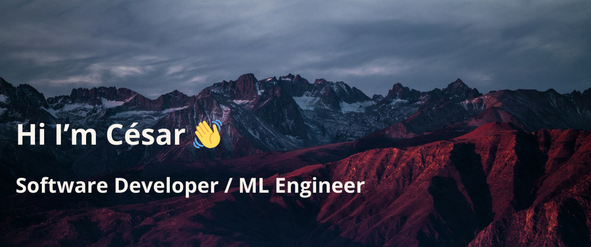

<h3 align="left">Connect with me:</h3>

## About me

- I am a **mathematics graduate** with 4+ years of experience in data science.
- Currently transitioning to Backend development because I want to focus on learning how to create scalable, maintainable software that adds value (with AI if it's really necessary 😉).
- My greatest passion is learning new things, and I try to dedicate a large part of my time to it.
- On my free time I like to spend time outdoors climbing and hiking 🏔️.

You can contact me via:

- ✉️ Mail: cesar.capilla97@gmail.com
- LinkedIn: https://www.linkedin.com/in/cesarcapillama/

